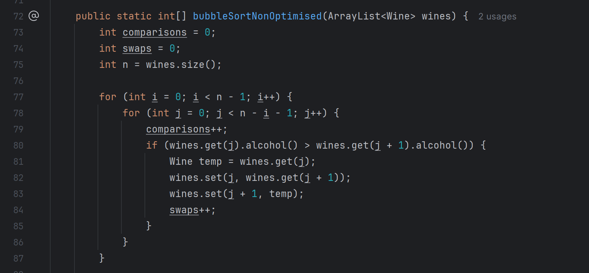
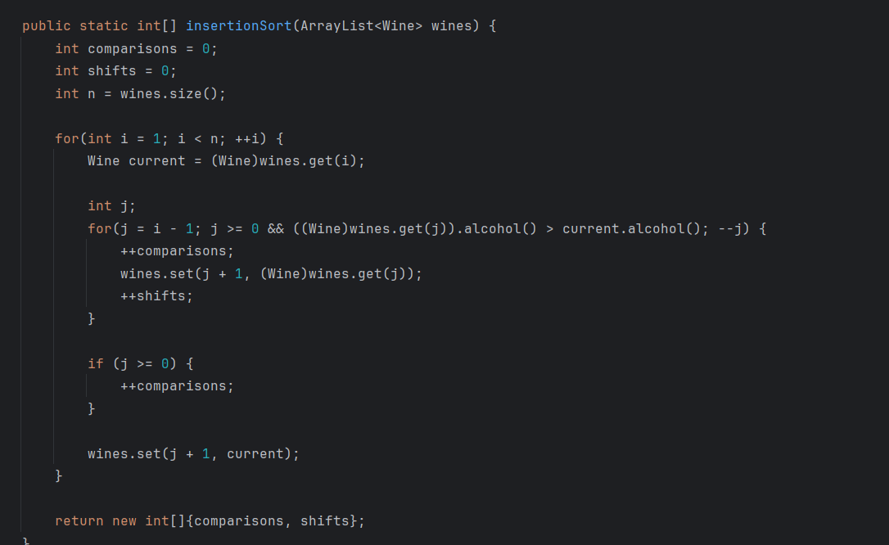
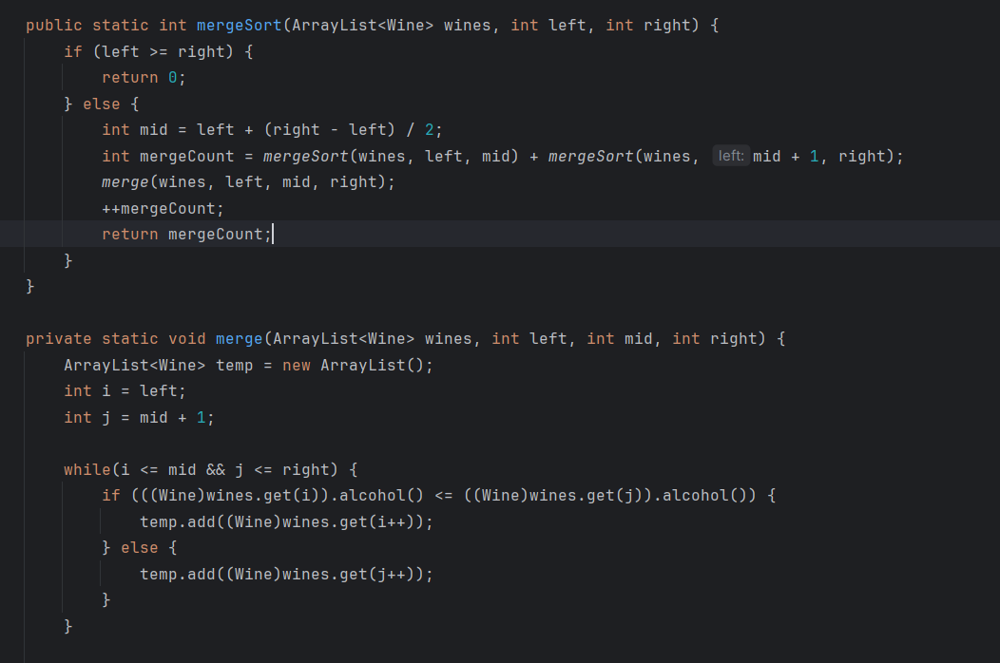
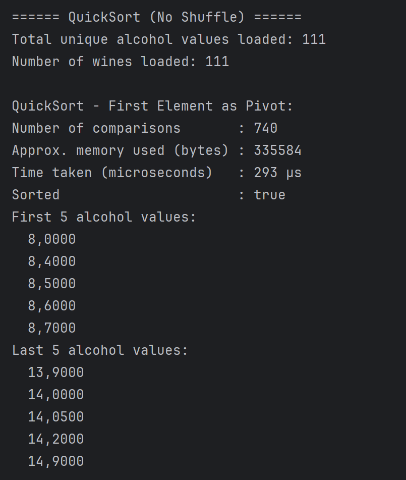
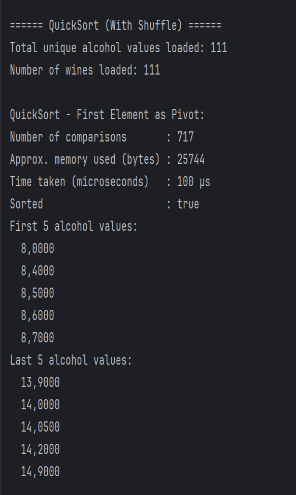

# Sorting Algorithms Analysis

Implementing and benchmarking four sorting algorithms in Java on a real dataset. Final exam for PG4200 Algorithms and Data Structures at Kristiania.

## Overview

The task was to implement Bubble Sort, Insertion Sort, Merge Sort and Quick Sort from scratch, run them on a real dataset, and analyse how they behave with and without shuffling. The data was the **Wine Quality Dataset** — all unique alcohol values from the red and white wine CSV files, giving **111 unique values** to sort in ascending order.

Each algorithm counts its own comparisons, swaps/shifts and merges so the theory can be checked against measured numbers.

## Results

**Bubble Sort** (non-optimised vs optimised with early-exit flag)

| | Comparisons (no shuffle) | Comparisons (shuffle) |
|---|---|---|
| Non-optimised | 6105 | 6105 |
| Optimised | 5895 | 6105 |

The non-optimised version always does the same work (O(n²) in every case); the optimised version's `swapped` flag lets it finish early on near-sorted data — best case O(n).

**Insertion Sort** — 2,711 comparisons without shuffle, 3,324 with shuffle. Sensitive to input order; best case O(n), average/worst O(n²).

**Merge Sort** — exactly **110 merge operations** in both runs, regardless of order. Comparisons barely moved (599 → 615). Guaranteed O(n log n), insensitive to input order.

**Quick Sort** — four pivot strategies compared:

| Strategy | Comparisons (no shuffle) | Comparisons (shuffle) |
|---|---|---|
| First element | 740 | 717 |
| Last element | 685 | 719 |
| Random | 752 | 798 |
| Median of three | **665** | **607** |

Median-of-three was the most reliable, consistently producing the most balanced splits and the fewest comparisons.

## Key takeaways

- The simple O(n²) algorithms (Bubble, Insertion) are very sensitive to how ordered the input is
- Merge Sort gives stable, predictable performance independent of input order
- For Quick Sort the pivot choice matters a lot — median-of-three avoids the worst-case splits that a naive first-element pivot can hit on partially sorted data

## Screenshots

Implementations in Java (Bubble, Insertion, Merge Sort):





Sample Quick Sort output, without and with shuffling:




## Source code

The full Java source is in [`src/`](src):

| File | What it does |
|------|-------------|
| `Wine.java` | A record holding one wine's alcohol value |
| `ImportData.java` | Loads unique alcohol values from the red & white wine CSVs |
| `Timer.java` | Measures execution time in microseconds |
| `Task1_BubbleSort.java` | Bubble Sort, optimised and non-optimised |
| `Task2_InsertionSort.java` | Insertion Sort |
| `Task3_MergeSort.java` | Merge Sort |
| `Task4_QuickSort.java` | Quick Sort with four pivot strategies |

Each `TaskN` file counts its own comparisons, swaps/shifts/merges, times the run, and prints the result both on the original and on a shuffled list.

## Running it

The data loader reads `winequality-red.csv` and `winequality-white.csv` from the classpath (the UCI Wine Quality Dataset, semicolon-separated). Put both CSVs where your classpath can find them, then:

```bash
javac -d out src/*.java
java -cp out:path/to/resources Task4_QuickSort
```

Swap in `Task1_BubbleSort`, `Task2_InsertionSort` or `Task3_MergeSort` to run the others.

## Tech

Java · Big-O complexity analysis · Wine Quality Dataset (Cortez et al., 2009)
